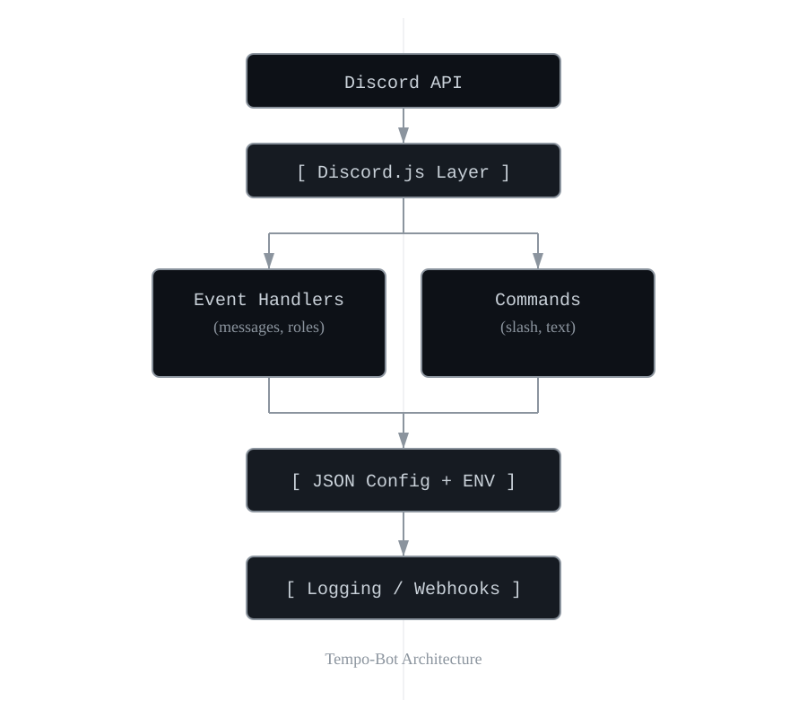

# 🎵 Tempo-Bot

> A modular Discord automation system for large-scale community management  
> **Project:** Tempo-Bot Community Operations | **Role:** Developer & Systems Administrator  
> **Duration:** 2021 – Present | **Last Updated:** October 2025  

---

## 🧭 Overview
Tempo-Bot is a custom **Node.js** and **Discord.js** automation framework purpose-built to manage and coordinate specific functions within a 45,000-member Final Fantasy XIV community.  
It unifies **administrative workflows, moderation tools, and event coordination** into a single, modular architecture that supports multi-server operations.

Developed and maintained independently, Tempo-Bot handles automation tasks such as role assignment, detailed logging, and information relaying. Reduces moderator workload and improves operational efficiency.

---

## ⚙️ Tech Stack

| Layer | Technologies |
|-------|---------------|
| **Language** | JavaScript (ES Modules) |
| **Core Frameworks** | Discord.js v14, Node.js 20 |
| **Runtime Environment** | Native Linux host (systemd/PM2 process management) |
| **Configuration** | JSON configuration files, `.env` secrets |
| **Monitoring** | Structured logging via console output and Discord webhooks |
| **Version Control** | Git + GitHub |

---

## 🚀 Core Features

| Category | Description |
|-----------|-------------|
| 🧩 **Modular Command Framework** | Dynamically loads commands, listeners, and interactions for quick feature expansion. |
| 🔒 **Role & Permission Management** | Enforces access control through role-based JSON configuration and guild mappings. |
| 🕹️ **Queue & Event Automation** | Handles embed-based information relays. |
| 🪪 **Logging & Audit Trails** | Sends structured moderation and event logs to secure Discord channels. |
| ⚡ **Scalable, Low-Maintenance Deployment** | Designed for 24/7 uptime under standard Node.js runtime with self-recovery via PM2. |

---

### 🧱 Architecture Overview

## 🧾 License

This project is licensed under the MIT License.  
© 2021-2025 Meetra Yarhu · Community Operations Systems Admin

---

## 🔗 Related Projects
- [Community-Operations-Systems-Admin](https://github.com/MeetraYarhu/community-operations-systems-admin) — documentation and governance system  
- [Coeurl Documentation Library](https://github.com/MeetraYarhu/community-operations-systems-admin/tree/main/03_Documentation)
